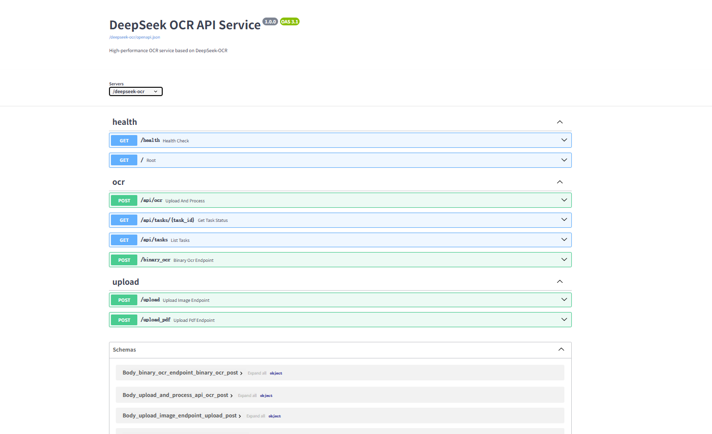
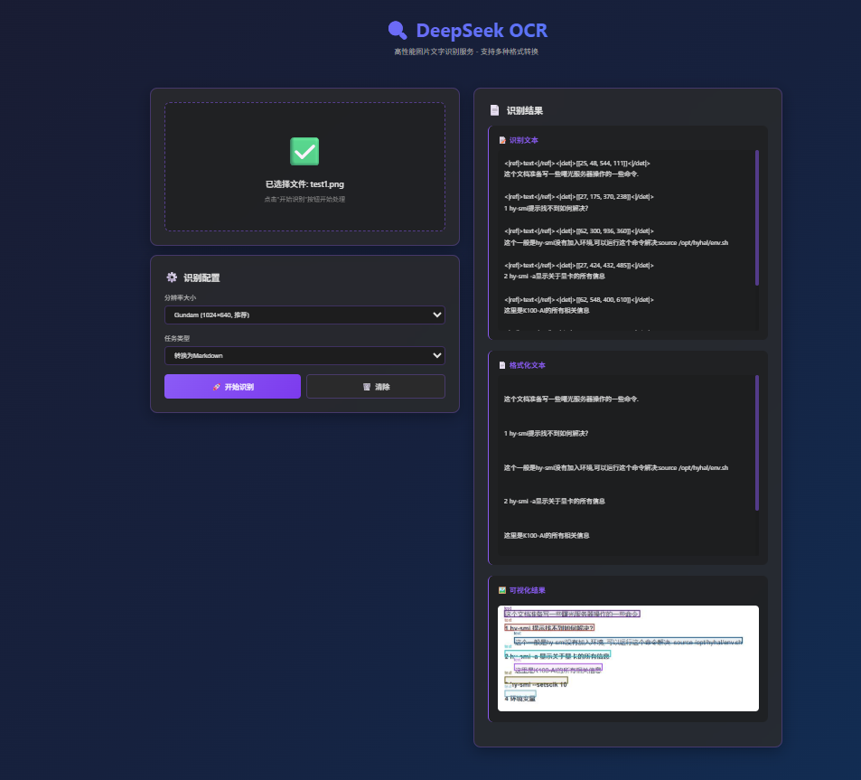

# DeepSeek OCR FastAPI Service

基于 DeepSeek-OCR 模型构建的高性能 OCR API 服务，使用 FastAPI 提供 RESTful 接口。

## 关于 DeepSeek-OCR-vllm

本项目使用了 [DeepSeek-OCR](https://github.com/deepseek-ai/DeepSeek-OCR) 项目中的模型代码。DeepSeek-OCR 是 DeepSeek AI 开源的 OCR 模型，支持使用 vLLM 进行高性能推理。



- **GitHub 地址**: https://github.com/deepseek-ai/DeepSeek-OCR
- **项目说明**: 本项目中的 `DeepSeek-OCR-vllm/` 目录直接来自原始 GitHub 项目，**未进行任何修改**。本 FastAPI 项目通过 `app/core/lifespan.py` 和 `app/services/ocr_service.py` 调用 DeepSeek-OCR-vllm 的功能，将其封装为 RESTful API 服务。

## 项目结构

```
deepseek-ocr-fastapi/
├── app/                      # 应用主目录
│   ├── __init__.py
│   ├── main.py              # FastAPI 应用入口
│   ├── api/                 # API 路由模块
│   │   ├── __init__.py
│   │   ├── routes.py        # 路由注册
│   │   └── endpoints/       # API 端点
│   │       ├── __init__.py
│   │       ├── health.py   # 健康检查
│   │       ├── ocr.py       # OCR 相关接口
│   │       └── upload.py     # 文件上传接口
│   ├── core/                # 核心模块
│   │   ├── __init__.py
│   │   ├── config.py         # 配置管理
│   │   ├── logging_config.py # 日志配置
│   │   ├── lifespan.py      # 生命周期管理
│   │   ├── middleware.py    # 中间件
│   │   └── exceptions.py    # 异常处理
│   ├── models/              # 数据模型
│   │   ├── __init__.py
│   │   └── schemas.py        # Pydantic 模型
│   ├── services/            # 服务层
│   │   ├── __init__.py
│   │   └── ocr_service.py   # OCR 业务逻辑
│   └── utils/               # 工具函数
│       ├── __init__.py
│       └── image_utils.py   # 图片处理工具
├── DeepSeek-OCR-vllm/       # DeepSeek OCR 模型代码（来源：https://github.com/deepseek-ai/DeepSeek-OCR）
├── run.py                   # 开发环境启动脚本
├── requirements.txt         # Python 依赖
├── Dockerfile              # Docker 镜像构建文件
├── docker-compose.yml      # Docker Compose 配置
└── README.md               # 项目说明文档
```


## 快速开始

### 1. 安装依赖

```bash
# 创建虚拟环境（推荐）
python -m venv venv
venv\Scripts\activate  # Windows
# source venv/bin/activate  # Linux/Mac

# 安装依赖
pip install -r requirements.txt
```

### 2. 配置环境变量

主要配置项（可通过环境变量设置）：

```bash
# 服务配置
export OCR_HOST=0.0.0.0
export OCR_PORT=8000
export OCR_WORKERS=1  # gunicorn worker 数量（生产环境，默认 1）
export OCR_LOG_LEVEL=INFO

# 模型配置
export MODEL_PATH=/models/DeepSeek-OCR
export CUDA_VISIBLE_DEVICES=0
export GPU_MEMORY_UTILIZATION=0.75
```

### 3. 启动服务

#### 开发/测试环境（使用 uvicorn）

```bash
# 使用 run.py（支持热重载）
python run.py
```

#### 生产环境（使用 Docker）

```bash
# 使用 docker-compose（推荐，使用 gunicorn + uvicorn worker）
docker-compose up -d
```

**注意**: 生产环境使用 `gunicorn` + `uvicorn.workers.UvicornWorker` 启动，提供更好的性能和稳定性。可以通过 `OCR_WORKERS` 环境变量配置 worker 数量。

### 4. 测试服务

```bash

# 访问 API 文档
http://localhost:8000/docs
```

## API 接口

### 1. 健康检查

```bash
GET /health
```

### 2. OCR 图片识别（异步任务接口）

**特点：** 立即返回任务ID，需要轮询任务状态获取结果

```bash
POST /api/ocr
Content-Type: multipart/form-data

参数:
- file: 图片文件
- include_visualization: bool (默认: true)
- resolution: str (tiny/small/base/large/gundam, 默认: gundam)
- task_type: str (free_ocr/markdown/parse_chart/locate_object, 默认: markdown)
- reference_text: str (可选，用于 locate_object 任务)
```

**响应：**
```json
{
  "task_id": "uuid-string",
  "status": "pending"
}
```

### 3. 查询任务状态

```bash
GET /api/tasks/{task_id}
```

**响应：**
```json
{
  "task_id": "uuid-string",
  "status": "completed",
  "result": {
    "text": "...",
    "processed_text": "...",
    "visualization_path": "..."
  }
}
```

### 4. 图片上传（同步接口，直接返回结果）

**特点：** 等待处理完成后直接返回结果，无需轮询

```bash
POST /upload
Content-Type: multipart/form-data

参数:
- file: 图片文件
- task_type: str (默认: markdown)
- resolution: str (默认: gundam)
```

**响应：** 直接返回OCR结果（包含识别文本、边界框等）

### 5. PDF 识别（同步接口，直接返回结果）

**特点：** 等待所有页面处理完成后直接返回结果

```bash
POST /upload_pdf
Content-Type: multipart/form-data

参数:
- file: PDF 文件
- task_type: str (默认: markdown)
- resolution: str (默认: gundam)
```

**响应：** 直接返回所有页面的OCR结果

### 6. 二进制 OCR（同步接口，直接返回结果）

**特点：** 接收二进制图片数据，直接返回结果

```bash
POST /binary_ocr
Content-Type: multipart/form-data

参数:
- image_data: 二进制图片数据
- height: int
- width: int
- task_type: str (默认: markdown)
- resolution: str (默认: gundam)
```

**响应：** 直接返回OCR结果

---

**接口选择建议：**
- **异步接口** (`/api/ocr`)：适合长时间处理、需要可视化结果
- **同步接口** (`/upload`, `/upload_pdf`, `/binary_ocr`)：适合快速处理、简单调用

详细说明请参考 `docs/API_ENDPOINTS.md`

## 配置说明

### 分辨率配置

- `tiny`: base_size=512, image_size=512, crop_mode=False
- `small`: base_size=640, image_size=640, crop_mode=False
- `base`: base_size=1024, image_size=1024, crop_mode=False
- `large`: base_size=1280, image_size=1280, crop_mode=False
- `gundam`: base_size=1024, image_size=640, crop_mode=True (推荐)

### 任务类型

- `free_ocr`: 自由 OCR 识别
- `markdown`: 转换为 Markdown 格式
- `parse_chart`: 解析图表
- `locate_object`: 通过参考文本定位对象

## 工程化改进

相比原始项目，本版本进行了以下工程化改进：

1. **模块化结构**: 将单文件应用拆分为多个模块
2. **生命周期管理**: 使用 FastAPI lifespan 管理资源
3. **统一配置**: 环境变量配置管理
4. **日志系统**: 结构化的日志记录
5. **异常处理**: 全局异常处理器
6. **中间件**: 请求日志和性能监控
7. **服务层**: 业务逻辑与 API 分离
8. **类型安全**: Pydantic 数据验证
9. **代码组织**: 清晰的目录结构

## 未来规划

### 任务队列与并发控制

1. **分布式任务队列**: 集成 Celery + Redis 实现异步任务处理
   - 支持任务队列管理、优先级调度
   - 实现任务超时控制和自动重试机制
   - 基于 Redis 控制 GPU 资源访问


## 许可证

本项目基于 MIT 许可证开源。

## 贡献

欢迎提交 Issue 和 Pull Request 来改进这个项目。

